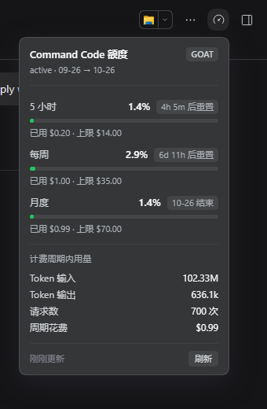

# dsh-commandcode-quota

在 DSH 会话中查看 Command Code 套餐还剩多少额度。

一个图标按钮，点开一张卡片，再点一次或点卡片外 / Esc 收起。



*截图取自 Windows 版 DSH；WSL / Linux 的界面与行为一致。*

## 平台支持

| 平台 | 状态 |
|---|---|
| Windows 10 / 11（原生 `dsh web`） | ✅ 已实测 |
| WSL2 / Linux | ✅ 已实测 |

两个平台共用同一份代码，界面与行为一致。唯一需要区别对待的是**安装**：
Windows 上用本地路径安装有一个跨盘注意点，见 [Windows 注意事项](docs/windows.md)。
DSH 版本以 0.1.7 为准（两个平台都在 0.1.7-rc.2 上验过）。

## 安装

```bash
dsh plugin --profile web add github:s11phere/dsh-commandcode-quota
```

装完**重启 `dsh web`**。卸载把 `add` 换成 `remove`，同样要重启。

> 别用 scp 风格的 `git@github.com:...` —— pnpm 会把它误解析成「包名 `git` + 版本」，
> 装出一个叫 `git` 的空依赖，插件不会生效。可用的写法见[开发文档](docs/development.md#安装)。

> **Windows：** 上面这条（走 GitHub）直接可用。但如果改用**本地路径**安装，而源码与
> `$DSH_HOME` 不在同一块盘，pnpm 会建出一个坏链接、安装整体失败，还会连带让同 profile 里
> 其它本地链接插件在启动时被跳过——见
> [Windows 注意事项](docs/windows.md#本地路径安装跨盘会建出坏链接)。

## 按钮在哪

会话头部右侧工具行（`conversation.session.header.utilities`），落在右侧面板开关左边，
是 DSH 原生位置。

**只在会话已开始（发过至少一条消息）后出现。** 空白会话和欢迎页里 DSH 根本不渲染这一行，
所以没有按钮。

## 配置

全部可选。在 profile 的 `cordis.patch.yml` 里按 id 覆盖：

```yaml
- id: dsh-commandcode-quota
  config:
    timeoutMs: 15000   # 单端点超时
    cacheMs: 3000      # 宿主侧结果缓存
    debug: true        # 打印凭据来源与注册结果
```

凭据与地址**不需要配置**：自动从 DSH profile 的 commandcode provider 路由、
`~/.dsh/.credentials.yaml`、环境变量依次发现。

## 刷新时机

页面加载、点开卡片、每 10 分钟各拉一次；标签页切回前台时若数据已过期再补一次。
四个数据端点各自独立降级——单个失败只在卡片底部提示，其余照常显示。

查额度是纯 GET，不消耗任何额度。

## 已知限制

- 按钮只在会话已开始后出现（见上）。
- token 进出与请求数来自 2–3 分钟一批的聚合，可能略滞后；额度窗口和花费是实时的。
- 账户级 API 不提供**缓存命中 / 未命中**的拆分，只有毛输入 token 总量。
- 数据来自官方 CLI 自用的内部接口（路径带 `alpha`），字段名有变更风险。

## 文档

- [数据来源与 API 契约](docs/api.md) — 四个端点、凭据发现顺序、月度上限怎么算、错误码
- [开发与验收记录](docs/development.md) — 跑测试、DSH 插件契约上的坑、验收做了什么
- [Windows 注意事项](docs/windows.md) — 本地路径安装的跨盘坑（自检与修复）、运行时差异、验收记录

## 许可

MIT
